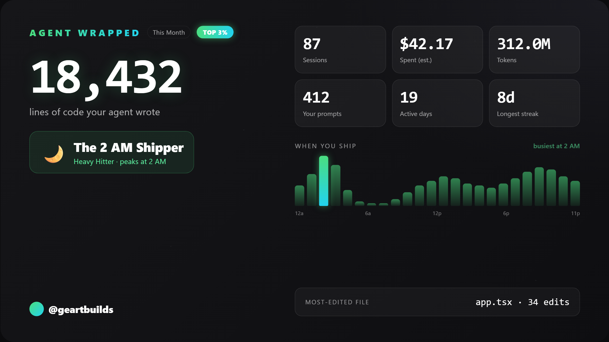
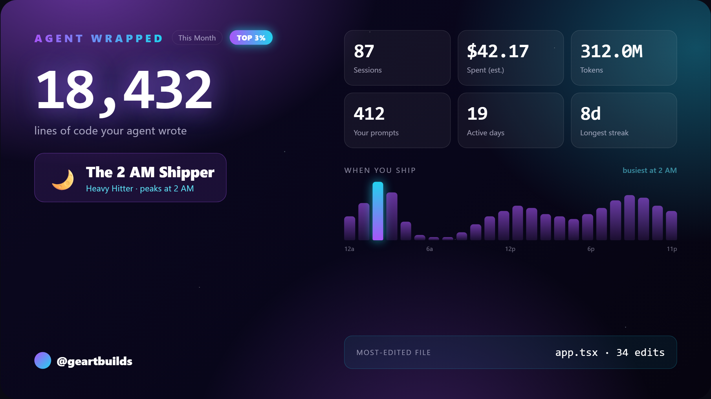
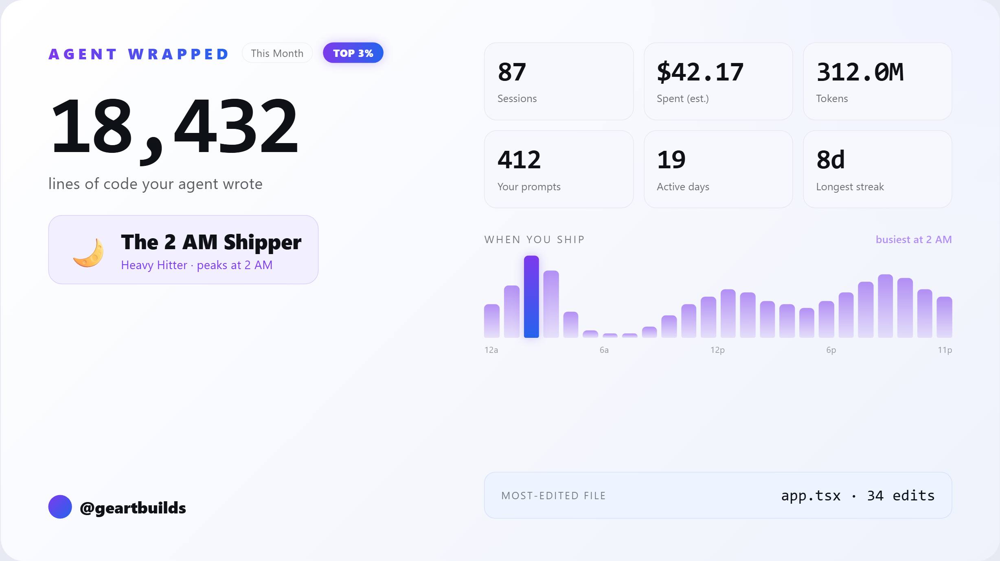
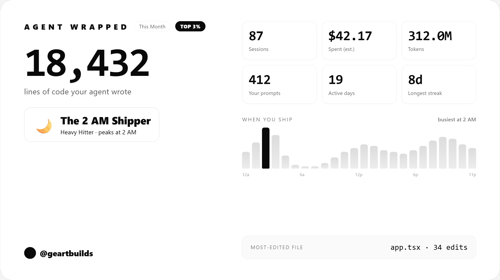
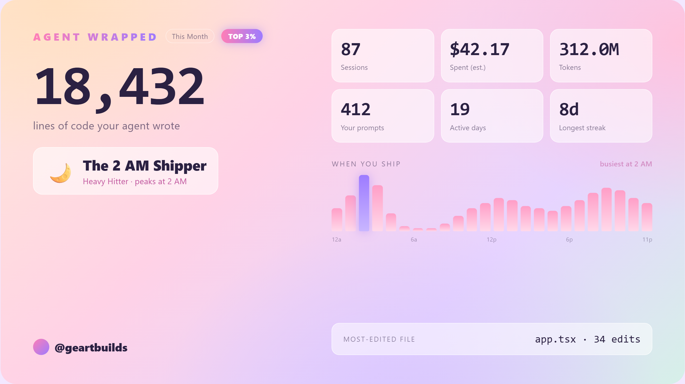

# Agent Wrapped 🎁

**Spotify Wrapped, but for your AI coding.**

One command turns your Claude Code history into a gorgeous, shareable card.

<p align="center">
  
</p>

```bash
npx github:geartbuilds/agent-wrapped
```

That's it. Needs [Node 18+](https://nodejs.org). Nothing to install.

---

## 📊 What you get

- 🤖 **Lines your agent wrote** — the number that hurts
- 💸 **What you spent** (estimated)
- 🌙 **Your busiest hour** — yes, it knows about 2 AM
- 🏆 **Your archetype** — Token Whale? Night Owl? Dawn Patrol?
- 😈 **An AI roast** of your habits (optional)

---

## 🎨 5 themes, one click

| Dark | Cosmic | Light | Minimal | Pastel |
|:--:|:--:|:--:|:--:|:--:|
|  |  |  |  |  |

Pick one on the card → **Download PNG** → post it.

---

## 🔒 100% local

Your logs never leave your machine. No account. No upload. No telemetry.

---

## 😈 The roast (optional)

Want Claude to roast your coding habits? It asks once how to run it:

- **Your Claude Code subscription** — free, uses your local `claude`
- **Your API key** — `ANTHROPIC_API_KEY`, costs ~$0.001
- **Skip it**

---

## ⚙️ Options

```bash
npx github:geartbuilds/agent-wrapped --all          # all-time, not just this month
npx github:geartbuilds/agent-wrapped --days 7       # last 7 days
npx github:geartbuilds/agent-wrapped --no-roast     # skip the roast
npx github:geartbuilds/agent-wrapped --help         # everything else
```

---

Built by [@geartbuilds](https://x.com/geartbuilds) · MIT · ⭐ it if it made you laugh
